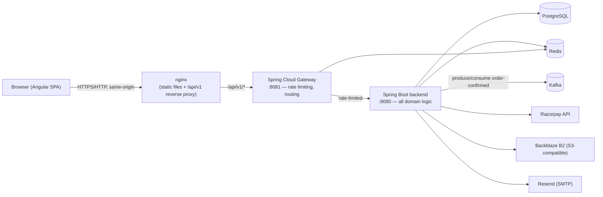

# NexCart

A small-scale, Amazon-style e-commerce application — built as a **production-honest deep dive into Java backend engineering**: concurrency control, idempotency, distributed-systems patterns, caching, rate limiting, and containerized deployment, wrapped in a real full-stack app rather than a toy CRUD demo.

## Table of contents

- [Overview](#overview)
- [Tech stack](#tech-stack)
- [Architecture](#architecture)
- [Features](#features)
- [System design & concurrency patterns](#system-design--concurrency-patterns)
- [Best practices followed](#best-practices-followed)
- [Edge cases & production scenarios covered](#edge-cases--production-scenarios-covered)
- [Project structure](#project-structure)
- [Running it locally](#running-it-locally)
- [Testing](#testing)
- [Deployment](#deployment)
- [API reference](#api-reference)
- [Known limitations](#known-limitations)

---

## Overview

NexCart lets a customer register, browse a product catalog, manage a cart, check out into an order, and pay for it via a **real Razorpay integration** (test/sandbox mode) — with an admin able to manage products, categories, and inventory behind the same API. Underneath that ordinary-sounding feature list is where the actual project lives: every operation that touches money or stock is built around an explicit concurrency strategy, not an assumption that requests arrive one at a time.

The system is split into three independently deployable pieces:

| App | Role |
|---|---|
| **`backend/`** | Spring Boot 4 REST API — owns every domain: users, products, inventory, cart, orders, payments, notifications |
| **`gateway/`** | Spring Cloud Gateway (reactive) — the single public entry point; rate-limits the product API and routes everything else through to the backend |
| **`frontend/`** | Angular 20 SPA — signals-based state, no NgRx; talks to the gateway, never the backend directly |

---

## Tech stack

**Backend**
- Java 21, Spring Boot 4.1.1, Gradle
- Spring Web (MVC/Tomcat), Spring Data JPA (Hibernate), Spring Security (JWT), Bean Validation
- PostgreSQL 16 — system of record
- Redis 7 — product-catalog caching + (via the gateway) rate-limiter token buckets
- Apache Kafka 3.7 (KRaft mode, no Zookeeper) — async order-confirmation → notification events
- Spring AOP / AspectJ — cross-cutting method-execution logging
- Spring Boot Actuator — health probes
- Razorpay Java SDK — real payment-gateway integration (test/sandbox keys)
- AWS S3 SDK v2 (pointed at Backblaze B2, S3-compatible) — product image storage
- Spring Mail (Resend SMTP relay) — transactional email
- JJWT — access/refresh token signing
- springdoc-openapi — Swagger UI
- JUnit 5, MockMvc, H2 (Postgres-compatibility mode) — testing

**Gateway**
- Spring Cloud Gateway 5.0 (WebFlux/Netty, fully reactive — deliberately separate from the servlet-stack backend)
- Spring Cloud 2025.1.0 ("Oakwood") release train
- Redis-backed `RedisRateLimiter` (token bucket, per-client-IP)

**Frontend**
- Angular 20 — standalone components, signals for state, no NgModules, no NgRx
- TypeScript, RxJS
- A hand-rolled design system — CSS custom properties, global utility classes, plain emoji as icons (see [Best practices](#best-practices-followed)); PrimeNG is wired up (theme provider configured) but not yet driving any actual UI

**Infrastructure**
- Docker & Docker Compose for every stateful dependency and, for deployment, for the apps themselves
- Nginx — serves the built Angular app and reverse-proxies `/api/v1/*` to the gateway in production

---

## Architecture



In production (see [Deployment](#deployment)) this entire diagram runs as six containers on one host, with nginx as the only publicly exposed port. In local IDE-based dev, only Postgres/Kafka/Redis run in Docker — the three apps run natively (`bootRun` / `bootRun` / `ng serve`) for fast iteration.

### Backend module layout

A **modular monolith**, not microservices — deliberately. `context.md` calls this out explicitly: start with clear domain boundaries inside one deployable, don't reach for service decomposition before there's a reason to. Each module under `com.nexcart.backend` is internally layered `controller → service (interface + impl) → repository → domain`, with request/response shapes in `dto/`:

```
user          — registration, login, JWT issuance, refresh-token rotation
product       — catalog, categories, product images
inventory     — available/reserved stock, the project's core concurrency surface
cart          — purchase intent only, never reserves stock
order         — checkout orchestration, order state machine
payment       — Razorpay integration, idempotent payment processing
notification  — async email, Kafka consumer
security      — JWT filter, Spring Security config
config        — external-client wiring (Kafka, Redis, S3, Razorpay, Actuator, AOP)
common        — shared exceptions, DTOs, cross-cutting logging aspect
```

A module only ever calls another module through its `Service` interface — never reaches into another module's `Repository` directly. This is enforced by convention and code review, not tooling, and is what makes "these modules could become services later" actually true rather than aspirational.

---

## Features

- **Auth**: registration, login, JWT access tokens (15 min) + rotating refresh tokens (30 days, HttpOnly cookie), logout, role-based authorization (`CUSTOMER` / `ADMIN`)
- **Product catalog**: paginated/searchable/filterable listing, product detail, category browsing, admin CRUD, multi-image upload with server-side compression (Thumbnailator) to S3-compatible storage
- **Cart**: add/remove/update line items, live stock-availability flags — cart never reserves inventory, it's purchase intent only
- **Checkout & orders**: cart → order conversion with price/stock revalidation at checkout time (never trusts stale cart prices), full order history, order-detail view, an explicit order state machine
- **Payments**: real Razorpay Standard Checkout integration — order creation, server-side HMAC signature verification, idempotent initiation (double-click and multi-tab safe)
- **Inventory management**: available vs. reserved quantity tracking, admin stock adjustment, oversell-proof concurrent decrement
- **Notifications**: async order-confirmation email via a Kafka consumer, isolated so a notification outage never blocks or fails an order
- **Caching**: Redis-backed product list/detail caching with live-stock freshness (catalog data is cached, inventory numbers never are)
- **Rate limiting**: the public product API is protected behind a Redis token-bucket limiter at the gateway, independent of the backend
- **Cross-cutting request logging**: an AOP aspect logs entry/exit for every service method at DEBUG, automatically masking sensitive parameters (passwords, tokens) and truncating oversized ones
- **Theming**: light/dark mode with a three-layer cascade (explicit choice → OS preference → light default)

---

## System design & concurrency patterns

This is the actual point of the project — concurrency correctness under real database contention, not simulated with mocks.

- **Pessimistic locking** (`SELECT ... FOR UPDATE` via `@Lock(PESSIMISTIC_WRITE)`) for every "read-then-mutate-atomically" operation: inventory decrement on checkout, payment completion, and payment-initiation dedup. The classic trap here — and one this codebase hit for real, causing an actual oversell before the fix — is that if an entity is read *unlocked* earlier in the same transaction, a later locked re-read of the *same row* can silently return Hibernate's stale first-level-cache copy instead of the freshly locked one. The DB lock is real; the in-memory value checked against it isn't. The fix pattern used throughout: make the locked read the transaction's *first and only* read of that entity.
- **Optimistic locking** (`@Version` on `Order`) plus an explicit state-machine guard, so a concurrent double-transition on the same order fails cleanly with `409 Conflict` instead of silently clobbering one update.
- **Idempotency-key pattern** for payment initiation: an application-level lookup first (an optimization, not the guarantee), backed by a database unique constraint + `saveAndFlush` + catching the resulting `DataIntegrityViolationException` as the real concurrency-safe path — the loser of a race just re-queries and returns the winner's row. Extended further with an order-scoped pessimistic-lock check so two tabs/a page refresh can't spin up two competing Razorpay orders for the same NexCart order.
- **Concurrent-checkout-for-last-unit test**: `OrderConcurrencyIntegrationTest` fires two simultaneous checkout requests at a product with exactly one unit of stock and asserts exactly one succeeds — the canonical "last item in stock" interview scenario, run against real threads and a real database, not mocked.
- **Real/Fake abstraction for every external dependency**: Kafka, S3-compatible storage, and the Razorpay gateway client are each a plain interface with a `@Profile("!test")` real implementation and a `@Profile("test")` fake — the fake Razorpay client even recomputes Razorpay's actual HMAC-SHA256 signature formula against a fixed test secret, so tests exercise genuine signature verification with zero network calls, rather than mocking the boundary away.
- **Cache-aside with a stock-freshness boundary**: Redis caches slow-changing catalog fields (title, description, price, images, status) with a 10-minute TTL; live inventory is *never* cached and is merged in at request time via a batched (not N+1) lookup — so a checkout never has to invalidate the product cache, and stock numbers are never stale.
- **API Gateway pattern**: a dedicated, independently deployable Spring Cloud Gateway service (not an in-process filter) fronts the backend, applying rate limiting and routing as a separate concern from business logic — the heavier, "real" architecture choice made deliberately over a lighter in-process alternative.
- **Async, failure-isolated side effects**: order confirmation publishes a Kafka event; the notification module consumes it independently. A downed notification consumer or Kafka itself never fails or blocks the order-creation request that triggered it.

---

## Best practices followed

- **Interface-per-module boundary** — cross-module calls always go through a `Service` interface, never a foreign `Repository`, keeping the modular monolith honestly decomposable later.
- **DTOs at every boundary** — JPA entities never leak into controller responses or requests.
- **Config-properties + separate client-config class** for every external integration (`XProperties` + `XConfig`) — the client bean always constructs successfully even with blank credentials; the corresponding service fails clearly and only when actually used, not at startup.
- **Secrets never hardcoded** — every credential is `${ENV_VAR:}` with a blank default in `application.properties`, sourced from a gitignored `.env` locally or real environment variables in deployment; `.env.example` documents every variable a new deployer needs.
- **Historical price integrity** — `OrderItem.unitPrice` is captured at checkout time and never recomputed from the current `Product.price`, so past orders stay accurate even after a price change.
- **No client-trusted security-critical state** — payment verification recomputes Razorpay's signature server-side against the order id *this server* stored at initiation time, never one submitted by the client, closing off a signature-replay attack against a cheaper transaction.
- **Structured, test-isolated integration testing** — `@SpringBootTest` + `MockMvc` against H2 in Postgres-compatibility mode, with `@BeforeEach` table cleanup in strict FK-respecting order.
- **Health-check-driven container orchestration** — every service in the deployment stack (including Postgres/Kafka/Redis) has a real healthcheck, and `depends_on: condition: service_healthy` chains startup order correctly rather than guessing with sleep delays.
- **Structured, masked, opt-in-verbosity logging** — the AOP request-logging aspect runs at DEBUG (not doubling default log volume), masks parameters explicitly marked `@LogMask`, and truncates any value over a length threshold rather than dumping large objects into logs.
- **12-factor-ish config** — every environment-specific value (DB host, Kafka bootstrap servers, Redis host, backend URI) is externalized, letting the identical build artifact run unmodified in dev, in Docker Compose, and in the EC2 deployment.

---

## Edge cases & production scenarios covered

Directly from this project's own design brief ([`context.md`](context.md)) — each of these has a corresponding code path or test, not just a plan:

| Scenario | How it's handled |
|---|---|
| Concurrent checkout for the last unit of stock | Pessimistic row lock on `Inventory`, verified by `OrderConcurrencyIntegrationTest` firing real concurrent threads |
| Double-click / multi-tab "Pay" | Idempotency-key dedup + order-scoped pessimistic lock reuses the same in-flight payment instead of creating a second Razorpay order |
| Payment failure / rejection | `verify()` touches zero state on a failed signature check — the order stays retryable, nothing is left half-updated |
| Duplicate payment-initiate requests | DB unique constraint on `idempotencyKey` is the real guarantee; the app-level cache lookup is just an optimization on top |
| Concurrent order state transitions | `@Version` optimistic lock — a stale transition fails with `409`, never silently overwrites |
| Notification service / Kafka down | Async, decoupled via Kafka consumer — order confirmation never fails or blocks on notification delivery |
| Stale product cache vs. live stock | Catalog fields are cached; inventory numbers are always read live and merged in at request time |
| Product edited/deactivated mid-cache-TTL | Writes evict the relevant cache entries immediately (`@CacheEvict`) rather than waiting out the TTL |
| Large user base hitting the product API | Redis-backed rate limiting at the gateway, isolated from backend capacity |
| Hibernate first-level-cache staleness under locking | Documented trap (see [System design](#system-design--concurrency-patterns)) with the fix pattern applied consistently: locked reads must be the transaction's first read of that entity |
| Client-submitted payment order id | Rejected by design — verification only ever checks the order id the server itself stored at initiation |
| Silently swallowed unexpected exceptions | The global exception handler logs every unanticipated exception at ERROR with full context before returning a generic 500 — nothing fails invisibly |

---

## Project structure

```
ecommerce/
├── backend/          Spring Boot API (Gradle) — see "Backend module layout" above
├── gateway/           Spring Cloud Gateway (Gradle) — rate limiting + routing
├── frontend/          Angular 20 SPA
├── docker-compose.yml Postgres + Kafka + Redis (always) and, via --profile full, the three apps
├── context.md         Original project spec / design brief
├── CLAUDE.md          Deep-dive engineering notes for AI-assisted development in this repo
└── DEPLOYMENT.md      EC2 + Docker Compose deployment runbook
```

---

## Running it locally

### Option A — IDE-based dev (fastest iteration)

**1. Start infra:**
```bash
docker compose up -d          # Postgres :5432, Kafka :9092, Redis :6379
```

**2. Backend** (from `backend/`):
```bash
./gradlew bootRun             # :8080
```

**3. Gateway** (from `gateway/`):
```bash
./gradlew bootRun             # :8081
```

**4. Frontend** (from `frontend/`):
```bash
npm install
npm start                     # :4200, talks to the gateway on :8081
```

Open **http://localhost:4200**.

### Option B — Full containerized stack (production-like)

```bash
cp .env.example .env          # fill in real values — see .env.example's comments
docker compose --profile full up -d --build
```

Open **http://localhost/** — nginx serves the built Angular app and reverse-proxies `/api/v1/*` to the gateway; everything is same-origin, no CORS involved. `docker compose ps` should show all six services `healthy`.

> First build compiles both Gradle projects and the Angular app from scratch — expect a few minutes.

---

## Testing

```bash
cd backend
./gradlew test                                                              # full suite, 73 tests, against H2
./gradlew test --tests "com.nexcart.backend.payment.PaymentIntegrationTest"  # one class
./gradlew test --tests "*.methodName"                                       # one method
```

Nearly every test is a full-stack `@SpringBootTest` + `MockMvc` integration test rather than a unit test with mocks — the goal is to exercise real Spring Security, real Hibernate/transaction behavior, and real (fake-implementation) external clients together, which is where concurrency and idempotency bugs actually live.

---

## Deployment

See **[DEPLOYMENT.md](DEPLOYMENT.md)** for the full runbook — deploying the entire stack (all six containers) to a single free-tier AWS EC2 instance via Docker Compose, including the memory tuning required to fit three JVMs and three data stores into 1 GB of RAM (capped heaps, a trimmed Kafka footprint, swap as a safety net).

---

## API reference

Once the backend is running, interactive API docs are available at:
- Swagger UI: `http://localhost:8080/swagger-ui.html`
- OpenAPI JSON: `http://localhost:8080/v3/api-docs`

All endpoints are versioned under `/api/v1`, covering auth, products, categories, product images, cart, orders, payments, and inventory.

---

## Known limitations

Kept as deliberate, documented scope rather than silently swept under the rug:

- **No payment webhook handler** — a payment that succeeds at Razorpay but whose browser callback never fires (e.g. the tab is closed mid-payment) is currently invisible to the app and needs manual reconciliation.
- **No TLS in the base deployment** — the EC2 runbook is plain HTTP; see `DEPLOYMENT.md`'s "Known limitations" for the TLS follow-up.
- **Free-tier deployment sizing is swap-reliant** — demo/portfolio-grade, not sized for real concurrent production load.
- **No CI/CD pipeline yet** — deploys are manual.
